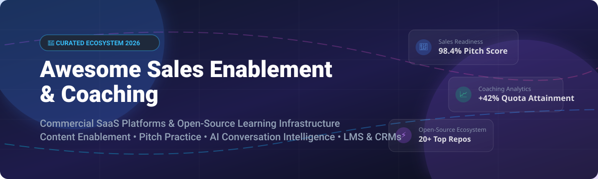

# 🚀 Awesome Sales Enablement & Coaching 

  

## 🌟 Top Sales Enablement, Training & Coaching Ecosystem

**A Curated List of Top SaaS Platforms & Open-Source GitHub Projects for Sales Training, Pitch Practice, Content Enablement & Learning Management Systems (LMS)**

*Focused on Content Enablement, Rep Coaching, AI Conversation Intelligence & Self-Hosted Learning Platforms.*

**Last updated: October 2026** 📅

---

### 💡 Overview & Market Insights

The global **Sales Enablement & Coaching Software Market** is estimated at **$3.4 Billion - $4.1 Billion** (2026) and is expanding at ~16-19% CAGR. 

The market is **moderately fragmented**: 
- **Enterprise Enablement & Readiness** is heavily dominated by a few major commercial leaders (*Highspot, Seismic, Mindtickle, Showpad*).
- **Conversation Intelligence & AI Coaching** is led by specialized suites (*Gong, Chorus/ZoomInfo*).
- **Open-Source Learning & CRM Infrastructure** (*Moodle, Canvas LMS, Twenty, n8n, Superset*) provides modular, privacy-first foundations for organizations building self-hosted custom enablement tech stacks.

---

## 📑 Table of Contents
- [💼 SaaS/Hosted Platforms](#-saashosted-platforms)
- [🔓 Open-Source GitHub Projects](#-open-source-github-projects)
  - [⚡ Workflow & Automation](#-workflow--automation)
  - [📈 Analytics & Coaching Dashboards](#-analytics--coaching-dashboards)
  - [💼 CRM & Activity Foundations](#-crm--activity-foundations)
  - [💬 Communication & Collaboration](#-communication--collaboration)
  - [📄 Content & Engagement Enablement](#-content--engagement-enablement)
  - [🎓 Learning Management Systems (LMS)](#-learning-management-systems-lms)
- [🛠️ Frameworks & Architectures](#️-frameworks--architectures)
- [🤝 How to Contribute](#-how-to-contribute)
- [☕ Support](#-support)
- [📊 Star History](#-star-history)
- [⚠️ Disclaimer](#️-disclaimer)

---

## 💼 SaaS/Hosted Platforms

The commercial Sales Enablement and Coaching software landscape categorized by company scale, starting tier pricing, and free trial access.

| 🏢 Platform | 💰 Starting Tier Price | 🎁 Free Tier / Free Trial Limits | 📊 Company Size (Revenue / Valuation) | 🎯 Best For & Key Features |
| :--- | :--- | :--- | :--- | :--- |
| **[Salesforce Sales Programs](https://www.salesforce.com/)** | $25/user/month (Starter Suite) | 30-day free trial with full CRM & enablement suite access | **$34.9 Billion Revenue** ($300B+ Market Cap) | **Native Enterprise CRM Enablement** — Coaching, onboarding programs, and scorecards embedded directly in Sales Cloud. |
| **[Gong Coaching](https://www.gong.io/)** | ~$1,200/user/year base platform fee + per-user seat license | 14-day free trial for qualified enterprise revenue teams | **$10.5 Billion Valuation** (~$250M ARR) | **Data-Driven Conversation Intelligence** — AI-powered call analysis, pitch feedback, and deal risk scoring. |
| **[Seismic](https://seismic.com/)** | ~$32/user/month (Enterprise tier) | 14-day custom guided trial demo | **$3.0 Billion Valuation** (~$350M ARR) | **Enterprise Content Automation** — Generative AI enablement, buyer engagement analytics, and Lessonly integration. |
| **[Highspot](https://www.highspot.com/)** | ~$35/user/month (Standard tier) | 14-day interactive guided sandbox trial | **$3.5 Billion Valuation** (~$200M ARR) | **Enterprise Sales Enablement** — Guided selling, content management, pitch practice, and AI recommendations. |
| **[Showpad](https://www.showpad.com/)** | ~$35/user/month (Essential tier) | 14-day free trial with sample content & buyer portal | **$1.0 Billion Valuation** (~$100M ARR) | **Field & Hybrid Sales Enablement** — Content distribution, buyer interactive portals, and pitch coaching. |
| **[Mindtickle](https://www.mindtickle.com/)** | ~$30/user/month (Readiness package) | 14-day sandbox access upon sales consultation | **$1.2 Billion Valuation** (~$80M ARR) | **Sales Readiness & Pitch Coaching** — AI role-play practice, rep onboarding programs, and skill certification. |
| **[Brainshark](https://www.brainshark.com/)** | ~$25/user/month (Pro tier) | 14-day free trial for video content creation | **~$500 Million Valuation** (Acquired by Bigtincan) | **Video-Based Readiness & Practice** — Sales training, video coaching scoring, and rapid content authoring. |
| **[Allego](https://www.allego.com/)** | ~$30/user/month (Standard package) | 14-day custom enterprise trial access | **~$300 Million Valuation** (~$60M ARR) | **Modern Coaching & Asynchronous Practice** — Video feedback, conversation intelligence, and just-in-time learning. |
| **[Lessonly (Seismic)](https://www.lessonly.com/)** | ~$20/user/month (Basic tier) | 14-day team trial access | **~$150 Million Valuation** (Acquired by Seismic) | **Team Learning & Practice** — Lightweight onboarding, continuous rep training, and practice scenario building. |
| **[SalesHood](https://www.saleshood.com/)** | ~$25/user/month (Enablement package) | 14-day free trial with pre-built sales playbooks | **~$50 Million Valuation** (~$15M ARR) | **All-in-One Sales Enablement** — Peer-to-peer coaching, deal enablement, and revenue team alignment. |

---

## 🔓 Open-Source GitHub Projects

Sorted descending by **GitHub Star Count** 🌟. Click any star badge to view the repo's stargazers.

### ⚡ Workflow & Automation

- **[n8n](https://github.com/n8n-io/n8n)**  ⚡
  **Workflow automation platform**, Sustainable Use License. **400+ integrations for automating sales enablement workflows, CRM data sync, content distribution, and follow-up sequences.**

- **[Activepieces](https://github.com/activepieces/activepieces)**  🤖
  **MIT-licensed AI-native automation platform.** **200+ integrations with MCP server support, perfect for lightweight open-source sales enablement workflows.**

### 📈 Analytics & Coaching Dashboards

- **[Grafana](https://github.com/grafana/grafana)**  📊
  **The de facto standard for open-source metrics & dashboards**, AGPL-3.0 licensed. **Connects to 100+ data sources to power operational sales coaching dashboards and performance tracking.**

- **[Apache Superset](https://github.com/apache/superset)**  📈
  **Leading open-source BI platform**, Apache-2.0 licensed. **Rich visualizations and SQL IDE for building customized sales coaching analytics and quota dashboards.**

- **[Metabase](https://github.com/metabase/metabase)**  🔍
  **Open-source business intelligence and analytics**, AGPL-3.0 licensed. **No-code question builder designed for sales managers to self-serve rep performance insights.**

### 💼 CRM & Activity Foundations

- **[Twenty](https://github.com/twentyhq/twenty)**  💼
  **Modern open-source CRM**, AGPL-3.0 licensed. **GraphQL API, custom objects, kanban pipelines, email integration, and workflow automation for tracking sales rep activity.**

- **[Odoo](https://github.com/odoo/odoo)**  🏢
  **Open-source enterprise suite & CRM**, LGPL-3.0 licensed. **Comprehensive CRM, lead scoring, document management, and employee training modules for end-to-end enablement.**

- **[Krayin CRM](https://github.com/krayin/laravel-crm)**  🎯
  **Open-source Laravel CRM**, MIT licensed. **Leads, contacts, accounts, quotes, and activities designed for custom PHP-based sales integrations.**

- **[SuiteCRM](https://github.com/suitecrm/SuiteCRM)**  📑
  **Enterprise-grade open-source CRM**, GPL-3.0 licensed. **Robust customer management, workflow modeling, and coaching activity tracking.**

- **[EspoCRM](https://github.com/espocrm/espocrm)**  🚀
  **Lightweight open-source CRM**, GPL-3.0 licensed. **REST API and webhooks ideal for capturing sales activity logs and feeding coaching models.**

### 💬 Communication & Collaboration

- **[Mattermost](https://github.com/mattermost/mattermost)**  💬
  **Open-source secure collaboration platform**, AGPL-3.0 licensed. **Channels, playbooks, and team messaging for real-time rep coaching and deal huddles.**

- **[Zulip](https://github.com/zulip/zulip)**  📢
  **Threaded open-source team chat**, Apache-2.0 licensed. **Topic-based threading ideal for sales rep Q&A, product announcements, and pitch discussions.**

- **[BigBlueButton](https://github.com/bigbluebutton/bigbluebutton)**  📹
  **Open-source web conferencing system**, LGPL-3.0 licensed. **Real-time audio, video, screen sharing, and interactive whiteboard for live sales pitch practice.**

### 📄 Content & Engagement Enablement

- **[Outline](https://github.com/outline/outline)**  📚
  **Open-source knowledge base & wiki**, BSL licensed. **Fast team documentation with markdown search and permissions, perfect for sales playbooks and battle cards.**

- **[Nextcloud](https://github.com/nextcloud/server)**  ☁️
  **Open-source content collaboration platform**, AGPL-3.0 licensed. **Self-hosted file sync, sharing, and document editing for secure sales collateral repositories.**

- **[Documenso](https://github.com/documenso/documenso)**  ✍️
  **Open-source document signing platform**, AGPL-3.0 licensed. **Digital signatures and contract execution for enablement workflows and sales agreements.**

- **[Formbricks](https://github.com/formbricks/formbricks)**  📝
  **Open-source experience & survey platform**, AGPL-3.0 licensed. **In-app and link surveys with conditional logic for capturing sales feedback and rep sentiment.**

- **[Papermark](https://github.com/mfts/papermark)**  📄
  **Open-source DocSend alternative**, AGPL-3.0 licensed. **Document sharing with analytics, custom domains, and view-tracking for buyer engagement.**

### 🎓 Learning Management Systems (LMS)

- **[Open edX](https://github.com/openedx/edx-platform)**  🏫
  **Enterprise-grade learning platform**, AGPL-3.0 licensed. **Adaptive learning pathways, video content hosting, and advanced analytics for sales certification.**

- **[Moodle](https://github.com/moodle/moodle)**  🎓
  **The world's most popular open-source LMS**, GPL-3.0 licensed. **SCORM compliance, course management, assessments, and certifications for sales onboarding.**

- **[Canvas LMS](https://github.com/instructure/canvas-lms)**  📖
  **Open-source learning management system**, AGPL-3.0 licensed. **Modern mobile-ready interface, quiz engine, and analytics for sales enablement programs.**

- **[Frappe LMS](https://github.com/frappe/lms)**  💡
  **Lightweight, modern open-source LMS**, MIT licensed. **Course creation, quizzes, and certification tracking built on Frappe Framework.**

- **[Sakai](https://github.com/sakaiproject/sakai)**  🏛️
  **Open-source learning and collaboration environment**, ECL-2.0 licensed. **Course management, discussion boards, and portfolio tools for enterprise training.**

- **[Chamilo](https://github.com/chamilo/chamilo-lms)**  🌐
  **Open-source LMS with collaboration tools**, GPL-3.0 licensed. **Easy course generation, skill tracking, and social learning features.**

---

## 🛠️ Frameworks & Architectures

Building a **self-hosted, open-source sales enablement and coaching stack**:

1. **Learning Management & Certification**: Combine **Moodle**, **Canvas LMS**, or **Open edX** for structured rep onboarding, SCORM content, and compliance tracking.
2. **Content Distribution & Analytics**: Use **Papermark** for collateral tracking, and **Outline** for sales playbooks and battlecards.
3. **CRM & Coaching Data**: Deploy **Twenty**, **Odoo**, or **EspoCRM** to capture rep touchpoints and pipeline activity.
4. **Interactive Practice & Communication**: Host **BigBlueButton** for live video pitch practice and **Mattermost** or **Zulip** for real-time rep coaching channels.
5. **Dashboards & Automation**: Connect **Apache Superset** or **Metabase** for manager dashboards, and automate workflows with **n8n**.

---

## 🤝 How to Contribute

Contributions are welcome! Help us maintain the top sales enablement resource:

1. **Fork** the repository 🍴
2. **Add/Edit** entries in `README.md` maintaining table/list formatting
3. **Include**: Platform name, GitHub repo / link, pricing/stars info, and key features
4. **Submit** a Pull Request with a clear title 🚀

---

## ☕ Support

If you find this repository helpful, consider supporting the project:

- 🌟 **Star this repository** on GitHub to increase visibility!
- 🔀 **Fork it** to customize your own sales tech stack map.
- 📢 **Share** with sales operations, revenue leaders, and sales enablement managers.
- 💖 **Sponsor the developer** on GitHub Sponsors:

Thank you for being part of the open sales enablement community! 🙏

---

## 📊 Star History

---

## ⚠️ Disclaimer

- This list is **community-curated** for educational purposes and does not constitute official commercial endorsement.
- Sales enablement repositories handle confidential sales decks and rep performance metrics. Self-hosted deployments require enterprise security and compliance checks.
- License compliance: Ensure AGPL-3.0, GPL-3.0, and BSL conditions match your organization's legal policies before deploying.

---

<b>Made with ❤️ for Sales Enablement Leaders, Revenue Operations & Sales Coaches Worldwide.</b>

